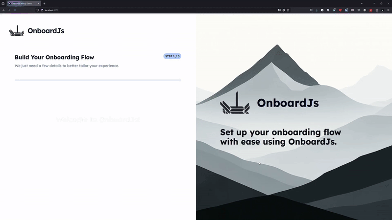

# OnboardJS – Headless, Flexible User Onboarding for React/Next.js ✨

> **The open-source, headless onboarding engine for React/Next.js. Build custom, dynamic onboarding flows with full control—code-first or visually.**

[](https://opensource.org/licenses/MIT)
[](https://discord.gg/RnG5AdZjyR)

[](https://onboardjs.com/docs)

---



Try out the [DEMO](https://demo.onboardjs.com)

---

## Why OnboardJS?

- **Headless-first:** Maximum UI/UX flexibility—bring your own design.
- **React/Next.js Native:** Seamless integration with hooks and context.
- **Declarative & Extensible:** Define flows as data, add custom logic, and persist anywhere.
- **Production-Ready:** TypeScript, high test coverage, and robust error handling.
- **Community-Driven:** Open-source, transparent roadmap, and welcoming to contributors.

---

## 🚀 Quickstart

To get started with OnboardJS, you can install the core library and the React bindings. This will allow you to use the headless onboarding engine in your React or Next.js applications.

### 1. Install

```bash
npm install @onboardjs/core @onboardjs/react
```

```bash
yarn add @onboardjs/core @onboardjs/react
# or
pnpm add @onboardjs/core @onboardjs/react
# or
bun add @onboardjs/core @onboardjs/react
```

### 2. Minimal Example

```typescript jsx
import { OnboardingProvider, useOnboarding } from '@onboardjs/react';

const steps = [
  { type: 'INFORMATION', payload: { title: 'Welcome!' } },
  { type: 'CUSTOM_COMPONENT', payload: { componentKey: 'ProfileForm' } },
];

const componentRegistry = {
  INFORMATION: InformationTypeStep,
  ProfileForm: ProfileFormComponent,
}

function OnboardingUI() {
  const { state, next, renderStep } = useOnboarding();

  return (
    <div>
      <h2>{state.currentStep?.payload.title}</h2>
      {renderStep()}
      <button onClick={() => next()}>Next</button>
    </div>
  );
}

export default function App() {
  return (
    <OnboardingProvider steps={steps} componentRegistry={componentRegistry}>
      <OnboardingUI />
    </OnboardingProvider>
  );
}
```

- See [@onboardjs/core README](https://github.com/Somafet/onboardjs/blob/main/packages/core/README.md) and [@onboardjs/react README](https://github.com/Somafet/onboardjs/blob/main/packages/react/README.md) README for full API and advanced usage.

## 💬 Join the Community

- 💬 **[GitHub Discussions](https://github.com/Somafet/onboardjs/issues)** - For Q&A, ideas, and showcasing.
- 🐛 **[GitHub Issues](https://github.com/Somafet/onboardjs/issues)** - For bug reports and feature requests for specific packages.
- 🗣️ **[Discord Server](https://discord.gg/RnG5AdZjyR)** - Join our community for real-time chat!
- 🐦 **Follow me on [BlueSky @somafet.bsky.social](https://bsky.app/profile/somafet.bsky.social)** for updates.

## 📦 Packages in this Monorepo

This repository is a [Turborepo](https://turborepo.org/) monorepo containing the following key packages:

- **[@onboardjs/core](https://github.com/Somafet/onboardjs/blob/main/packages/core/README.md)**: Headless, framework-agnostic onboarding engine.
- **[@onboardjs/react](https://github.com/Somafet/onboardjs/blob/main/packages/react/README.md)**: React bindings for seamless UI integration.
- **Examples ([apps/examples](https://github.com/Somafet/onboardjs/tree/main/apps/examples))**: Examples and recipes for using OnboardJS in various scenarios.
- **Internal**: Shared ESLint/TS configs for consistency.

---

## 🛠️ Getting Started (Development)

1. **Clone & Install:**
   ```bash
   git clone https://github.com/Somafet/onboardjs.git
   cd onboardjs
   pnpm install
   ```
2. **Build All Packages:**
   ```bash
   pnpm build
   ```
3. **Run Tests:**
   ```bash
   pnpm test
   ```
4. **Lint & Format**
   ```bash
    pnpm lint
    pnpm format
   ```

---

## Contributing

See [CONTRIBUTING.md](https://github.com/Somafet/onboardjs/blob/main/CODE_OF_CONDUCT.md) for more details.

---

## 📚 Documentation

- **[Main Documentation Site](https://onboardjs.com/docs)**
- **[@onboardjs/core README](https://github.com/Somafet/onboardjs/blob/main/packages/core/README.md)**
- **[@onboardjs/react README](https://github.com/Somafet/onboardjs/blob/main/packages/react/README.md)**

---

## 🗺️ Roadmap

- **v1.0**: Stable, documented releases for core & react
- **Next.js Starter Templates**: Beautiful, animated, production-ready with integration examples (e.g., Supabase, Neon, Resend, etc.)
- **Helper Packages**: (e.g., Supabase persistence)
- **Builder App MVP**: Visual drag-and-drop onboarding builder
- **Premium Builder Features**: Code export, hosted flows, analytics
- **Community Growth**: Tutorials, examples, active support

---

## 📝 License

This monorepo and its packages (unless specified otherwise in individual package licenses) are licensed under the [MIT License](https://github.com/Somafet/onboardjs/blob/main/LICENSE.md).

---

We're thrilled to have you Onboard 😉. Let's make building amazing onboarding experiences easier for everyone!
